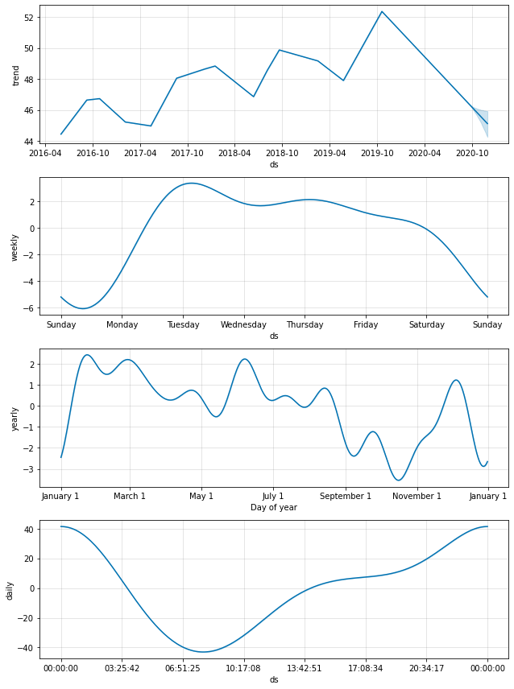
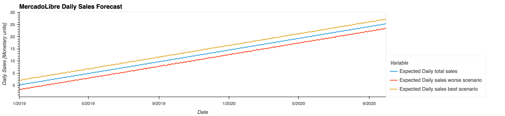
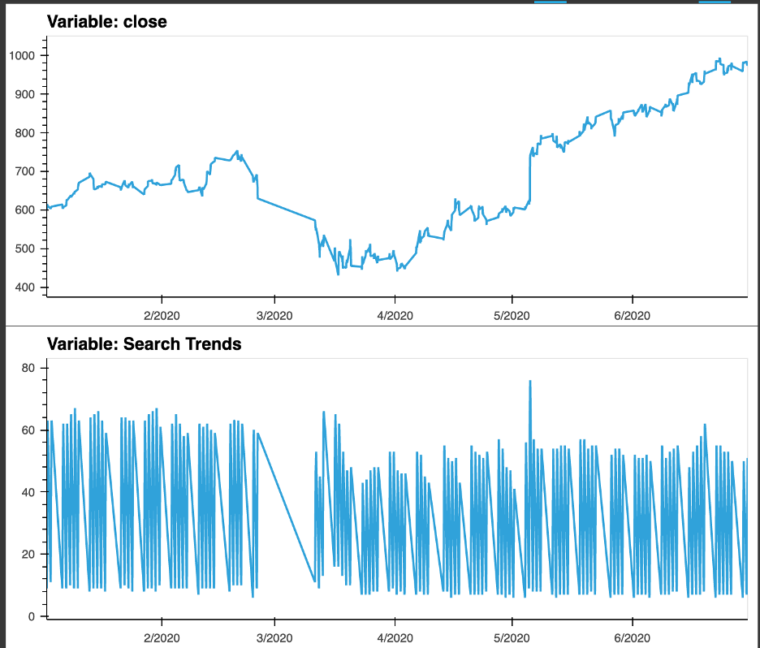
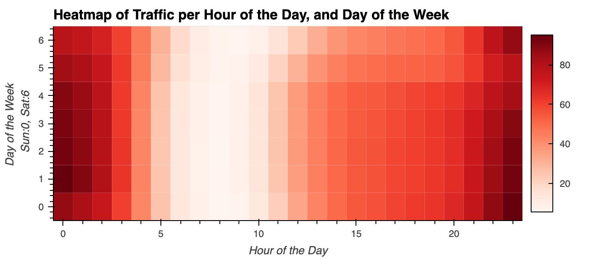
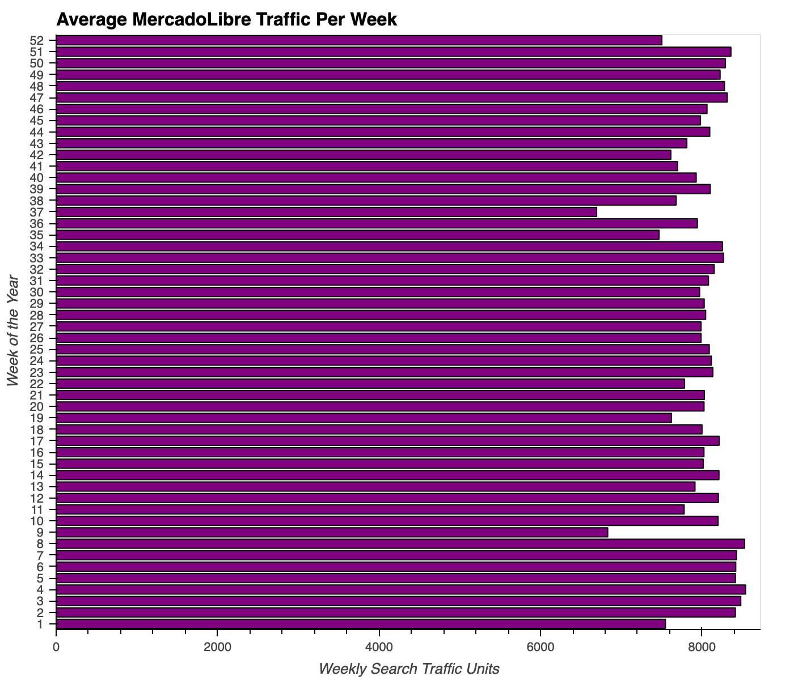
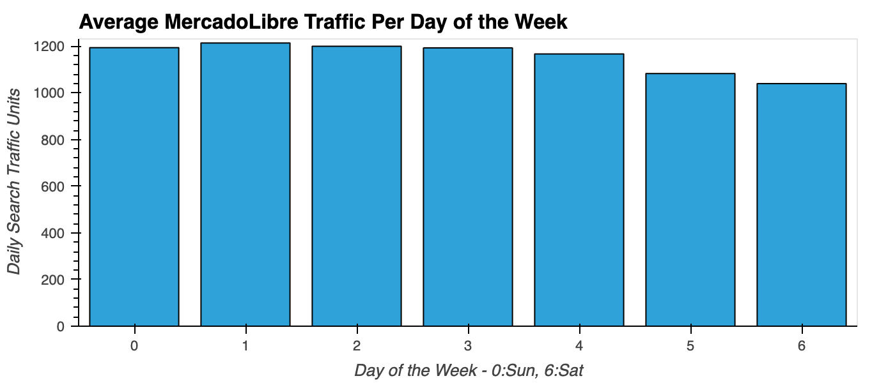
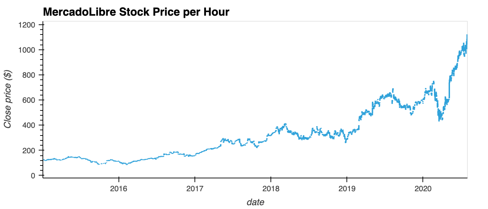
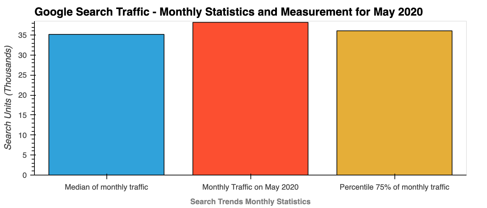

# Forecasting_Net_Prophet
This notebook shows time series analysis, emphasizing the use of indexing data on dates, and the forecasting of sales and Google searches using Facebook Prophet. The analysis shows how to decompose time series in trends, seasonality, and periodicity.

The time series tools are applied to marketing analysis of MercadoLibre, which is a lider providing online shopping in Latin America.

## Technologies
The analysis is done in Google Colab at https://colab.research.google.com. The main technologies used are:
`Pandas`, `Holoviews`, `Facebook Prophet`, `Hvplot`, `Datetime`, `Numpy` and `Matplotlib inline`.

## Instalation Guide

If you don't have this tools, you need to install them:
*  `!pip install pystan`
* `!pip install fbprophet`
*  `!pip install hvplot`
*  `!pip install holoviews`

The installation appear in the first cewll of the notebook.

## Usage

The main file is the ``forecasting_net_prophet.ipynb`` Jupyter Notebook. You should open it in Google Colab and run it completely in order to see the graphs.

For the upload of the files, the files should be selected during the run. There are three files to upload, and the cells to do it are the ones with this code:

`from google.colab import files`

`uploaded = files.upload()`

The files are in the Resources folder, and needs to be selected on the spot.

### Some charts you will see in Google colab once you run the notebook are as follows.

#### Seasonality Analysis of the Mercado Libre Google Search Data

#### Stock Close Price and Google Search Trends Subplots

## Contributors
This project was coded by Paola Carvajal Almeida, paola.antonieta@gmail.com.

Contact email: paola.antonieta@gmail.com
LinkedIn profile: https://www.linkedin.com/in/paolacarvajal/

## License
This project uses a MIT license. This license allows you to use the licensed material at your discretion, as long as the original copyright and license are included in your work files. This license does not contain a patent grant,  and liberate the authors of any liability from the use of this code.